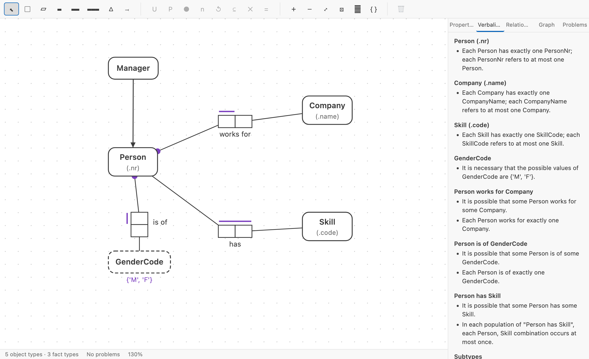
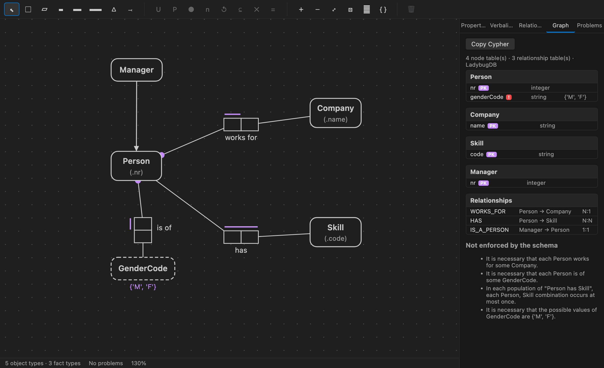

# Factum — Object-Role Modeling (ORM 2)

*factum* — a thing done; a fact.

Draw a conceptual schema in ORM 2 notation, read it back as English sentences, check it for errors,
and map it to a relational **or** property graph schema — without leaving the editor.

In the spirit of [NORMA](https://www.ormfoundation.org/), but native to VS Code and storing models as
plain JSON, so they diff and merge like the rest of your source.

**[Documentation and guide →](https://www.factum-orm.com/)**



## Why Object-Role Modeling

ORM describes a domain as **elementary facts** — *Person works for Company* — instead of tables or
classes. Because those facts are attribute-free, every constraint is explicit and every model can be
read back as plain sentences a domain expert can confirm or reject. You decide how it becomes tables
or nodes afterwards, and the same model can become both.

## Features

### Draw the conceptual schema

Entity types and value types with reference modes (`Person(.nr)`), unary through n-ary fact types with
multiple readings, subtyping, objectification (nesting) and derived fact types. Drag to move, marquee
to multi-select, drag a role onto an object type to connect it, double-click to rename in place —
typing `Person(.nr)` sets the name and reference mode at once.

Constraints are drawn in standard ORM 2 notation: internal and external uniqueness, preferred
identifiers, simple and disjunctive mandatory, frequency, all ten ring types, subset, exclusion,
equality, value and cardinality — each editable in the properties panel and each carrying an
alethic/deontic modality.

### Read the model back in English

A live FORML verbalization of the whole model. Click any sentence to select what it describes.

```text
Each Person works for exactly one Company.
In each population of "Person has Skill", each Person, Skill combination occurs at most once.
It is necessary that the possible values of GenderCode are {'M', 'F'}.
```

### Catch mistakes while you draw

Missing reference schemes, fact types without a uniqueness constraint, uniqueness constraints too
narrow to keep a fact type elementary, unattached roles, reading/arity mismatches, subtype cycles and
incompatible ring or set-comparison roles — reported in the Problems panel and highlighted on the
diagram.

### Map to a relational schema

Rmap-style mapping in the *Relational* tab, and SQL DDL for PostgreSQL, SQL Server, MySQL, SQLite or
ANSI SQL. Functional fact types are absorbed as columns, compound-unique fact types get their own
table, unaries become booleans, subtypes are absorbed into their supertype, and value constraints
become `CHECK` constraints.

### Map to a labeled property graph



The same model, mapped to a property graph for **[LadybugDB](https://docs.ladybugdb.com/)**. ORM
carries more than a hand-drawn graph model does, and the mapping uses it:

- entity types become node tables, keyed by their reference mode;
- lexical value types become **properties**, and are promoted to nodes only when played
  many-to-many, where a single-valued property could not hold them;
- binary fact types become relationship tables whose **multiplicity is read off the uniqueness
  constraints** — a constraint on one role makes that end the "one" end;
- an n-ary fact type cannot be an edge, so it is **reified** into a node linked to each role player:
  the Levi (bipartite) form of the hyperedge the fact type really is.

```cypher
CREATE NODE TABLE Person(nr INT64 PRIMARY KEY, genderCode STRING);
CREATE REL TABLE WORKS_FOR(FROM Person TO Company, MANY_ONE);
CREATE REL TABLE HAS_STUDENT(FROM Enrolment TO Student, MANY_ONE);
```

LadybugDB enforces primary keys and multiplicities. Everything else ORM can state — mandatory roles,
value ranges, ring and set-comparison constraints — is carried into the script as verbalized comments
rather than quietly dropped:

```cypher
//   [mandatory] It is necessary that each Person works for some Company.
```

### Exchange models with other fact-based tools

`ORM: Import Model` reads NORMA `.orm` XML, the FBM Exchange MetaModel `.fbm`, an Apache Ossie
ontology or a Unified Modelling Schema document, and writes an `.orm.json` beside it — picking the
reader from the file, since Ossie and UMS share `.yaml`. `ORM: Export Model As` writes any of the
four back out.

| Format | Import | Export | Fidelity |
| --- | --- | --- | --- |
| NORMA `.orm` | yes | yes | Conceptual both ways; diagram geometry is read but not written |
| FBM `.fbm` | yes | yes | Conceptual both ways; the closest to a lossless round trip |
| Apache Ossie ontology | yes | yes | Conceptual; objectification and the diagram have no counterpart |
| Unified Modelling Schema | yes | yes | Logical; export is faithful, import recovers the schema, not the model |

Both directions report what they could not carry rather than dropping it silently, so an export to
Ossie tells you it left your objectified fact type behind. See
[the format comparison](https://www.factum-orm.com/interop.html) for what each format
holds and why Factum keeps one of its own.

### Start from examples, not from a blank diagram

`ORM: Derive Model from Example Data (CSV)` reads a table and proposes a first-draft schema — the
step both Halpin's design procedure and FCO-IM begin with. An identifying column becomes the
entity's reference mode, types and enumerations are inferred from the values, every row is kept as a
sample fact, and each assumption comes back as a note to confirm.

Nothing is proposed that the data does not support: a column distinct across three rows is not
called unique, because at that size it is coincidence.

### Check the model against its own examples

Fact types carry a **sample population** — real tuples, stored in the same file. The verbalizer
substitutes them back into the readings, so a domain expert reads *"101 works for Acme"* rather than
a placeholder, and the validator checks the constraints you drew against the examples you gave. A
uniqueness constraint your own data contradicts is reported, not believed.

### Export

SVG and PNG export of the diagram, plus force-directed auto-layout.

## The command line

The model is a text file, so a build can check it. `factum` runs the same core the editor does.

```bash
factum validate model.orm.json --format github   # annotate a CI run
factum verbalize model.orm.json --population     # read it back, examples and all
factum diff before.orm.json after.orm.json       # what the model now says
factum drift model.orm.json schema.sql           # where the database disagrees
factum derive people.csv -o people.orm.json      # a first draft from examples
factum ddl model.orm.json --dialect postgres
factum convert model.orm.json --to fbm
```

### In a pull request

The bundled GitHub Action validates the model and comments with the sentences that changed — not
`"roles": ["r1"]` appearing in a diff, but:

```diff
- Each Person works for at most one Company.
+ Each Person works for exactly one Company.
```

```yaml
- uses: Volland/factum-orm@v0
  with:
    model: model/domain.orm.json
    base: /tmp/base.orm.json   # the same file from the base branch
    strict: 'true'
```

A complete workflow is in [`examples/model-check.workflow.yml`](examples/model-check.workflow.yml);
copy it into `.github/workflows/`.

### Schema drift

`factum drift model.orm.json schema.sql` compares the schema the model maps to against one that
already exists — a `pg_dump --schema-only`, a migration, anything with `CREATE TABLE` in it — and
prints the differences with the `ALTER` statements that would reconcile them. No database driver is
needed, because it reads SQL rather than connecting.

## For coding agents

`factum-mcp` is an MCP server over a model, so Claude Code, Copilot or any MCP client can read the
conceptual schema rather than guessing at it from the tables:

```jsonc
{ "mcpServers": { "factum": { "command": "factum-mcp" } } }
```

It exposes `read_model`, `verbalize_model`, `validate_model`, `generate_schema`, `diff_models`,
`detect_drift`, `read_population` and `apply_model`. Everything is read-only except the last, which
validates first and refuses to write a model with blocking errors.

## Quick start

1. Run **ORM: New ORM Model** from the Command Palette and choose where to save it.
2. The diagram opens with a small example schema. Press `E` and click to add an entity type,
   `2` and click to add a binary fact type, then `C` and drag from a role box to an object type to
   connect them.
3. Click role boxes to select them, then use the constraint buttons in the toolbar (`U` uniqueness,
   `P` preferred identifier, `●` mandatory, and so on).
4. Watch the *Verbalization* tab to check the model says what you meant.

## Keyboard and mouse

| Action | Binding |
| --- | --- |
| Select tool / entity / value type | `V` / `E` / `T` |
| Unary / binary / ternary fact type | `1` / `2` / `3` |
| Subtype link / connect role | `S` / `C` |
| Zoom to fit | `F` |
| Auto-layout | `Ctrl/Cmd+Alt+L` |
| Delete selection | `Delete` |
| Undo / redo | `Ctrl/Cmd+Z` / `Ctrl/Cmd+Shift+Z` |
| Pan / zoom | Middle-drag or drag empty canvas / wheel |
| Rename in place | Double-click a shape |
| Add to selection | `Shift`-click |

## Commands

| Command | Description |
| --- | --- |
| `ORM: New ORM Model` | Create a starter `.orm.json` and open the diagram |
| `ORM: Import NORMA (.orm) File` | Convert a NORMA ORM 2 XML file |
| `ORM: Import Model (NORMA, FBM, Ossie, UMS)` | Convert any supported interchange document |
| `ORM: Export Model As (NORMA, FBM, Ossie, UMS)` | Write the model out in an interchange format |
| `ORM: Derive Model from Example Data (CSV)` | Propose a first-draft model from a table of examples |
| `ORM: Verbalize Model` | Full FORML verbalization as Markdown |
| `ORM: Show Relational Mapping` | Mapped tables as a Markdown table |
| `ORM: Generate Relational Schema (SQL DDL)` | SQL DDL in a new editor |
| `ORM: Generate Property Graph Schema (LadybugDB)` | LadybugDB Cypher DDL in a new editor |
| `ORM: Export Diagram as SVG` / `as PNG` | Save the diagram as an image |
| `ORM: Auto-Layout Diagram` | Re-arrange the diagram |
| `ORM: Open Model Source (JSON)` | Open the model as text |

## Settings

| Setting | Default | Description |
| --- | --- | --- |
| `orm.ddl.dialect` | `postgres` | SQL dialect for generated DDL |
| `orm.ddl.quoteIdentifiers` | `false` | Always quote generated identifiers |
| `orm.graph.subtypeStrategy` | `nodeTable` | `nodeTable` (own label + `IS_A`) or `absorb` |
| `orm.graph.ifNotExists` | `false` | Emit `IF NOT EXISTS` in the generated graph DDL |
| `orm.validation.enabled` | `true` | Report model problems in the Problems panel |
| `orm.verbalization.mode` | `forml` | `forml` or plainer English |
| `orm.diagram.snapToGrid` | `true` | Snap shapes to the grid |
| `orm.diagram.gridSize` | `10` | Grid size in pixels |
| `orm.diagram.showGrid` | `true` | Show the grid |

## File format

`*.orm.json` holds the conceptual schema and its diagram layout in one id-addressed structure,
described by a published [JSON Schema](schema/orm-model-2.schema.json) that VS Code uses to validate
and complete the file in the plain text editor:

```jsonc
{
  "$schema": "https://www.factum-orm.com/schema/orm-model-2.schema.json",
  "version": 2,
  "name": "HR",
  "objectTypes": [
    { "id": "ot_person", "name": "Person", "kind": "entity", "refMode": "nr", "dataType": "integer" }
  ],
  "factTypes": [
    {
      "id": "ft_works",
      "roles": [
        { "id": "r1", "objectTypeId": "ot_person" },
        { "id": "r2", "objectTypeId": "ot_company" }
      ],
      "readings": [
        { "id": "rd1", "roleOrder": ["r1", "r2"], "text": "{0} works for {1}", "isPrimary": true }
      ]
    }
  ],
  "subtypeRelations": [],
  "constraints": [
    { "id": "uc1", "kind": "uniqueness", "roles": ["r1"] },
    { "id": "mc1", "kind": "mandatory", "roles": ["r1"] }
  ],
  "diagram": { "shapes": { "ot_person": { "x": 120, "y": 200 } } }
}
```

Readings use `{0}`, `{1}`, … placeholders indexing into `roleOrder`, the same convention NORMA uses.
The file is safe to hand-edit; the editor repairs missing collections on load. Because the diagram is
a custom editor over a text document, VS Code's dirty state, undo stack and file watching all work
normally — and `ORM: Open Model Source (JSON)` shows the text behind the picture at any time.

### Metadata

Every element may carry a `meta` object — `guid`, `uri`, `title`, `shortDescription`, `description`,
`synonyms`, `tags`, `aiContext` and `source`. None of it changes what the conceptual schema means. It
is there so a model survives a round trip through another fact-based modeling tool, and so generators
have something to say beyond an element's name: `meta.description` becomes the comment on the
generated table and node table.

The fields have counterparts in the formats Factum has to interoperate with rather than being
invented — `guid` and the two descriptions are the FBM Exchange MetaModel's `GUID`,
`ShortDescription` and `LongDescription`; `synonyms` is its `Synonyms` and Apache Ossie's
`ai_context.synonyms`; `aiContext` is Ossie's `ai_context`.

### Schema generation hints

A `hints` object steers generation per target. A hint never changes the conceptual schema, only how
that schema is rendered — strip every hint from a file and the model still says the same thing. A
name given in a hint is a physical name and is used verbatim.

```jsonc
{
  "id": "ot_person", "name": "Person", "kind": "entity", "refMode": "nr",
  "meta": { "description": "A human being known to the business." },
  "hints": {
    "relational": { "tableName": "HR_PERSON", "columnName": "PERSON_NR" },
    "graph": { "label": "Employee", "labels": ["Party"] }
  }
}
```

| Hint | Applies to | Effect |
| --- | --- | --- |
| `relational.schemaName` | model | Qualifies every generated table |
| `relational.tableName` | object type, fact type | Physical table name |
| `relational.columnName` | value type, role | Physical column name |
| `relational.sqlType` | value type | SQL type, instead of the one derived from `dataType` |
| `relational.mapping` | fact type | `absorb` or `separateTable` |
| `graph.label` | object type, fact type | Node label or relationship type |
| `graph.labels` | object type | Additional node labels |
| `graph.propertyName` | value type, role | Name of an absorbed property |
| `graph.mapping` | value type | `node` or `property` |

A hint that would make the generated schema lose facts is refused rather than obeyed, and the
refusal appears in the mapping notes: asking for `graph.mapping: "property"` on a value type played
many-to-many leaves it a node, because a single-valued property cannot hold many values.

Unknown target keys are legal and preserved, so another tool can carry `hints.ossie` or
`hints.typedb` without a change to this format.

### Extensions and versioning

Any key beginning with `x-` is an extension: legal anywhere, ignored by the editor and written back
unchanged, following the OpenAPI convention. The loader is deliberately more permissive than the
schema — it preserves *every* unrecognised top-level key, so a misspelled key is a warning in the
editor rather than data lost on the next save.

`version` is the format's major version, currently `2`. Version 2 only adds optional `meta`, `hints`
and `lang` keys, so a version 1 file is a valid version 2 file: it is upgraded on load and written
back as version 2.

## Mapping rules

The relational mapping follows Rmap:

- a fact type whose only uniqueness constraint spans every role becomes its own table with a
  composite key;
- an n:1 or 1:1 fact type is absorbed as a column (or columns) into the table of the object type
  playing the uniquely-constrained role, on the mandatory side for 1:1;
- a unary fact type becomes a boolean column;
- mandatory roles produce `NOT NULL`, optional ones `NULL`;
- an entity type's reference mode expands into its identifying column; compound identifiers expand
  recursively, and an object type with no reference scheme gets a surrogate key plus a mapping note;
- objectified fact types map to their own table keyed by the objectified roles;
- subtypes are absorbed into their supertype's table with optional columns, and an exclusive subtype
  partition adds a discriminator column with a `CHECK`.

The property graph mapping starts from the same schema but answers a different question:

- an entity type becomes a node table, keyed by its reference mode, by a single-role preferred
  identifier over a value type, or — failing both — by a generated `SERIAL` key;
- a value type stays a property unless it is played many-to-many or in an n-ary fact type;
- a binary fact type becomes a relationship table with `MANY_ONE`, `ONE_MANY`, `ONE_ONE`, or
  `MANY_MANY` when only a spanning uniqueness constraint applies;
- a unary fact type becomes a `BOOLEAN` property;
- an n-ary or objectified fact type is reified into a node with one `MANY_ONE` relationship per role;
  role links to the same player share one relationship table with several `FROM ... TO ...` pairs.
  Objectify a fact type to name its node yourself;
- subtypes get their own label joined by `IS_A`, or are absorbed when `orm.graph.subtypeStrategy`
  is `absorb`.

Mapping notes explaining each choice appear beside the schema and as comments in the generated script.

## Known limitations

- The NORMA exporter does not write diagram geometry: NORMA's diagram section carries shape state
  well beyond position, and a partial one is worse than none.
- Sample populations, multi-page diagrams and join paths on set-comparison constraints are read from
  FBM but not modelled, so they do not survive a round trip through Factum.
- Apache Ossie's `ontology_mappings` — the binding from concepts down to dataset fields — is neither
  read nor written. It is the natural home for a `hints.ossie` target.
- Derivation rules are stored and verbalized but not evaluated.
- Drift detection reads SQL text rather than connecting to a database, and understands
  `CREATE TABLE` only — indexes, views and triggers are ignored.
- Model derivation makes every column a binary fact type about one entity type. Splitting the
  columns that are really about something else is still the modeller's job.
- The graph mapping targets LadybugDB's Cypher DDL. Other property graph databases will need small
  syntax adjustments.

## Documentation

The site includes a **[mini book on ORM 2](https://www.factum-orm.com/book.html)** — ten
short chapters covering elementary facts, the constraint family, subtyping and objectification, and
Halpin's seven-step design procedure worked end to end. Every figure in it is rendered by the
extension's own renderer and links to the model file behind it, so any example can be opened and
taken apart in the editor. Regenerate the figures with `npm run figures`.

The full documentation site lives in [`docs/`](docs/) and is published with GitHub Pages:
[book](https://www.factum-orm.com/book.html),
[getting started](https://www.factum-orm.com/getting-started.html),
[mapping rules](https://www.factum-orm.com/mapping.html),
[reference](https://www.factum-orm.com/reference.html) and the
[file format](https://www.factum-orm.com/file-format.html).

## Development

```bash
npm install
npm run compile      # bundle the extension and webview into out/
npm run watch        # rebuild on change
npm test             # model, verbalization, validation, mapping and rendering tests
npm run typecheck
npm run vsix         # build a .vsix package
```

Press `F5` to launch an Extension Development Host on the `examples/` folder.

The extension host code lives in `src/extension.ts` and `src/editor/`; the diagram runs in a webview
(`src/webview/`). Both share the model, verbalizer, validator and mappers in `src/model/` and
`src/core/`, which are plain TypeScript with no VS Code or DOM dependencies — which is why they are
straightforward to test and to reuse outside the editor.

## Credits

Object-Role Modeling is the work of Terry Halpin and the fact-oriented modeling community. Factum is
an independent implementation and is not affiliated with the ORM Foundation or the NORMA project.

## License

MIT.
